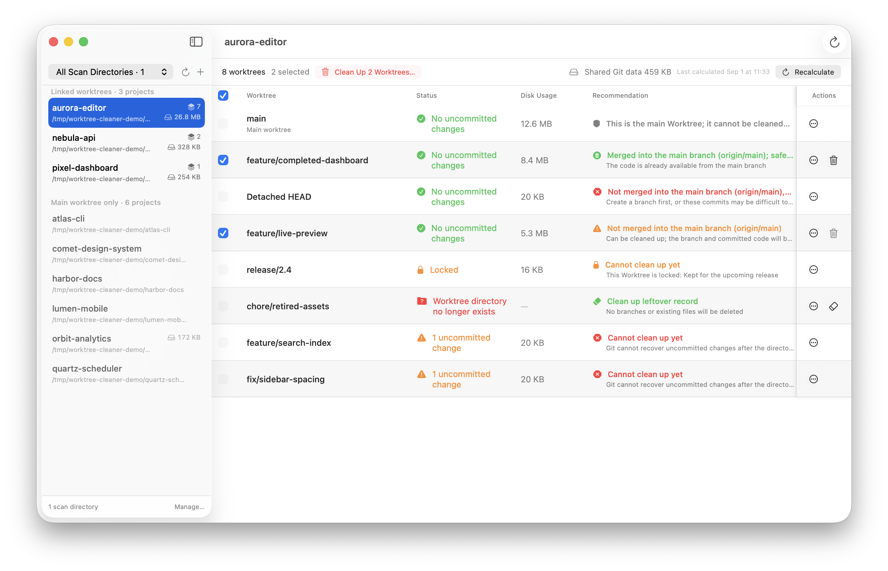

  

# Worktree Cleaner

Find, inspect, and safely clean up Git worktrees across all your projects.

Worktree Cleaner is a native macOS app for developers who use Git worktrees for
parallel tasks, experiments, or agent sessions. Add one or more scan directories
and the app finds the repositories inside them, shows every registered worktree,
measures disk usage, and helps you decide what can be removed.

  

## Features

- **🔍 Recursive discovery**: Find Git repositories across multiple scan directories.
- **🗂️ Focused project list**: Group projects with linked worktrees so cleanup
  candidates are easy to find.
- **🩺 Worktree health**: Inspect branch, Git status, lock state, disk usage, and
  cleanup recommendations.
- **🚀 Quick path actions**: Open a worktree in Finder or an installed editor or
  terminal, or copy its path.
- **🧹 Safe cleanup**: Remove one or multiple eligible linked worktrees while
  preserving their Git branches.
- **🧾 Stale registration cleanup**: Clean up Git worktree registrations for
  directories that no longer exist.
- **💾 Efficient disk insights**: Cache disk-usage results while refreshing Git
  status independently.

## Safety first

Worktree Cleaner is deliberately conservative:

- It rechecks the current Git state immediately before removing a worktree.
- It never uses forced removal and never deletes a branch as a side effect.
- Main, dirty, locked, and otherwise unsafe worktrees are blocked from cleanup.
- A clean worktree with unmerged commits can be cleaned up when a branch keeps
  those commits reachable. An unmerged detached HEAD is blocked until a branch
  is created for it.
- Recommendations are based on local Git state and should still be reviewed before
  deletion.

## Install

Download the latest signed and notarized build from the
[latest GitHub release][releases].
Unzip it, move `WorktreeCleaner.app` to your Applications folder, and open it.
Future updates can be installed from inside the app.

Worktree Cleaner requires macOS 14 or later and a Git installation available at
`/usr/bin/git`.

## Getting started

1. Select **Choose Directory** and add a directory that contains your Git projects.
2. Choose a discovered project from the sidebar.
3. Review its worktrees, status, disk usage, and cleanup recommendation.
4. Use the path menu to open a worktree, or remove it when you are satisfied that
   its work is no longer needed.

Adding a scan directory does not modify its contents. Worktree Cleaner only changes
files when you explicitly confirm a worktree cleanup.

## Project documentation

- [Development](docs/development.md)
- [Architecture and safety decisions](docs/architecture.md)
- [Release process](docs/releasing.md)

[releases]: https://github.com/vincentbel/worktree-cleaner/releases/latest
